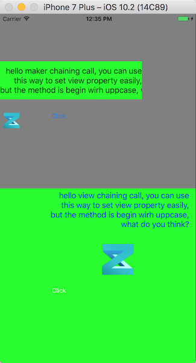

# DRViewMaker
A easy way to assign UIView(and subclasses) properties with chaining call.
There are two ways to use this tool: maker or view.

##Example

```
///////  Maker /////////
UIView *makerView =  UIView.maker.backgroundColor(UIColor.grayColor).frame(CGRectMake(0, 0, [UIScreen mainScreen].bounds.size.width, [UIScreen mainScreen].bounds.size.height/2)).addTo(self.view);
    
UILabel.maker.backgroundColor(UIColor.greenColor).text(@"hello maker chaining call, you can use this way to set view property easily, do you love it?").textAlign(NSTextAlignmentRight).lineBreakMode(NSLineBreakByClipping).frame(CGRectMake(0, 100, 300, 80)).numberOfLines(3).lineBreakMode(NSLineBreakByClipping).addTo(makerView);
    
UIImageView.maker.image([UIImage imageNamed:@"zhiku"]).frame(CGRectMake(0, 200, 50, 50)).contentMode(UIViewContentModeScaleAspectFit).addTo(makerView);
UIButton.maker.frame(CGRectMake(100, 200, 50, 30)).titleFont([UIFont systemFontOfSize:13]).titleStatePair(@[@"Click", @(UIControlStateNormal), @"Release", @(UIControlStateHighlighted)]).addTo(makerView);
    
///////  View /////////
UIView *view = UIView.new.Frame(CGRectMake(0, makerView.frame.size.height, makerView.frame.size.width, makerView.frame.size.height)).BackgroundColor(UIColor.greenColor).AddTo(self.view);

UILabel.new.Frame(CGRectMake(100, 0, 300, 90)).Text(@"hello view chaining call, you can use this way to set view property easily, but the method is begin wirh uppcase, what do you think?").NumberOfLines(0).TextAlign(NSTextAlignmentRight).TextColor(UIColor.blueColor).AddTo(view);
    UIImageView.new.Image([UIImage imageNamed:@"zhiku"]).ContentMode(UIViewContentModeScaleAspectFill).Frame(CGRectMake(200, 100, 100, 100)).AddTo(view);
UIButton.new.Frame(CGRectMake(100, 200, 50, 30)).TitleFont([UIFont systemFontOfSize:13]).TitleStatePair(@[@"Click", @(UIControlStateNormal), @"Release", @(UIControlStateHighlighted)]).AddTo(view);
```



## Todo
Add more View into this tool, like UISwitch, UISlider, even common user-custom views.